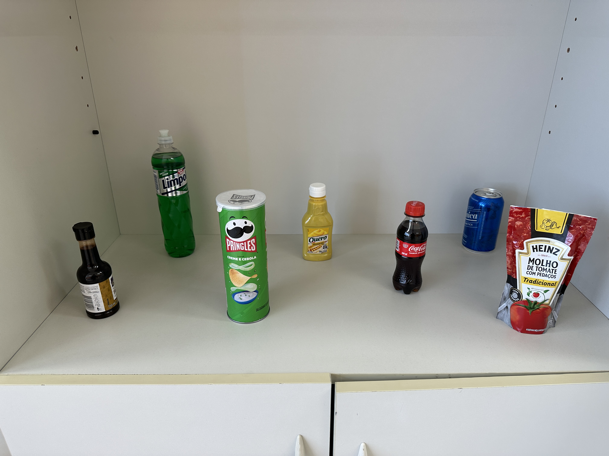
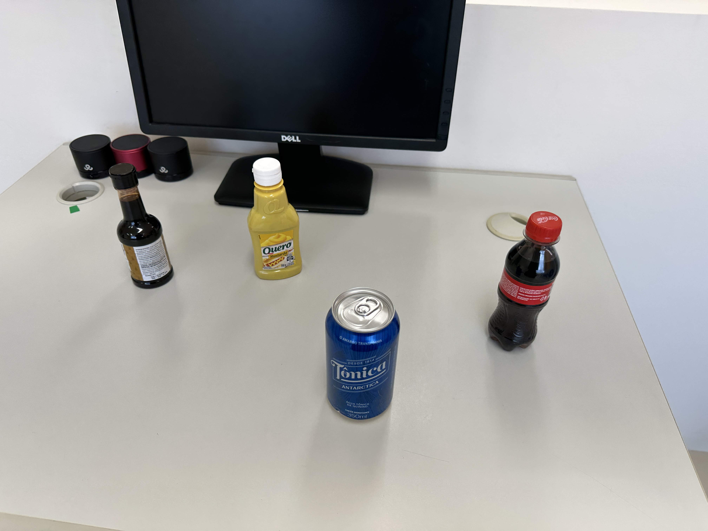
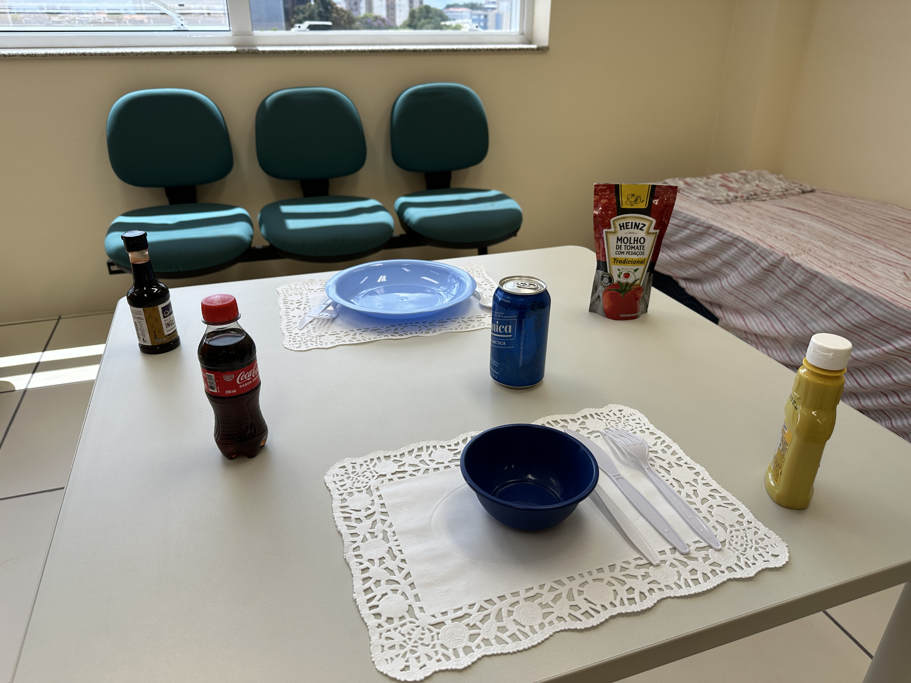

# YoloV8 Object Detection on Custom Dataset

**This repository will guide you to deploy a custom object detection model using YoloV8**

## Requirements

- Python 3.8 or higher
- Google Colab (Recommended) or Jupyter Notebook
- Roboflow Account
- A custom object dataset (100 images or more)

## Image Capturing

- Start taking photos of the objects in different environments and situations. Try to apply as much diversity as you can, switching tables, switching backgrounds, changing object places and object that appear at once. Take photos without objects too. You'll need at least 100 images or more for a 10 object dataset. Usually, the bigger your dataset is, the better is the result.

## Labeling

- Create a project in Roboflow and upload your dataset. Start drawing the bounding boxes and labeling each object on the picture. This can be done by multiple people at once. You can find further information on how to label a dataset in the [YoloV8 Training Notebook](https://colab.research.google.com/drive/1B8lmcT6vX-NuXnOKLv7EqUmoROdhxIKq?usp=sharing)

## Augment

- As you finished labeling your images, you'll export the dataset in the YoloV8 format (download as zip) and will be following the instructions on the [YoloV8 Dataset Augmentation](https://github.com/Baggiio/yolo_dataset_augmentation) repository.

- Upload the augmented images to the same dataset in Roboflow and generate a new version. Try to augment even more using Roboflow augmentation. Select export and copy the snippet.

## Training

- With the dataset ready and the download snippet copied, go to the [YoloV8 Training Notebook](https://colab.research.google.com/drive/1B8lmcT6vX-NuXnOKLv7EqUmoROdhxIKq?usp=sharing) (preferably on Google Colab) and follow the instructions to train your YoloV8 model and export.

## Useful links

- [Roboflow](https://roboflow.com/)
- [YoloV8 Docs](https://docs.ultralytics.com/)
